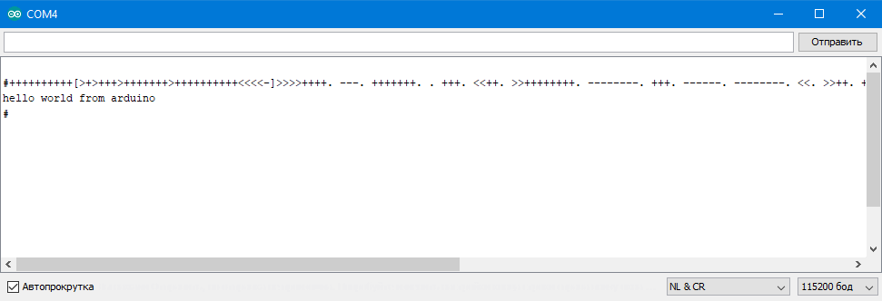

# Arduino_8086_emulator

Port [Fake86](https://github.com/rubbermallet/fake86) on Arduino
Only the core of the processor is ported. Some DOS and Bios interruptions are emulated.

In the screenshot, the brainfuck interpreter running on the emulator

Порт эмулятора [Fake86](https://github.com/rubbermallet/fake86) на Arduino
Портировано только ядро процессора, эмулируются некоторые прерывания DOS и Bios

На скриншоте интерпретатор brainfuck, работающий на эмуляторе